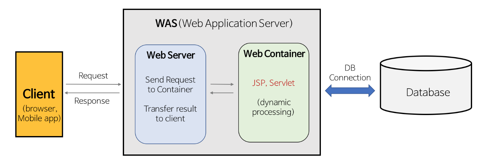

## < 웹서버 >

- 리소스에 대한 HTTP요청을 받아, 콘텐츠를 클라이언트에게 돌려줌
- HTTP 프로토콜 구현, 웹 리소스 관리, 웹서버 관리 기능 제공

## < 웹서버가 하는 일>

✅ 1단계. 클라이언트와 커넥션을 맺는다

- 클라이언트의 접속 받아들이거나, 원치 않는 클라이언트라면 닫는다.
- 커넥션이 맺어지면, 커넥션에서 ip주소를 추출 > 어떤 클라이언트가 있는지 확인함
- 새 커넥션이 맺어지면, 서버는 새 커넥션을 커넥션 목록에 추가한다.

 

✅ 2단계. 요청에세지 수신 - http요청 메세지를 받는다.

- 커넥션에 데이터가 도착하면 웹서버는 http요청 메세지를 읽어들여 파싱한다
  - 메세지의 헤더를 읽는다. 메세지 헤더는 CRLF로 끝난다.
  - 메세지 본문(바디)가 있으면 이거도 읽어들인다.
- 요청 메세지 파싱할 때 웹서버는 입력 데이터를 네트워크로부터 뷸규칙하게 받는다.
  네트워크 커넥션은 언제라도 무효화될 수 있다.

   

✅ 3단계. 요청 처리

- 요청 메세지를 해석하고, 행동을 취한다.
- http메세지에서 메서드, 리소스,헤더,본문 을 얻어내어 처리한다.

 

✅ 4단계. 리소스 매핑과 접근

- 정적 콘텐츠 제공 : html페이지, jpeg이미지 같은 미리 만들어진 정적 콘텐츠 제공
- 동적 콘텐츠도 제공 : 서버 위에서 동작하는 리소스 생성 앱을 통해 만들어진 동적 콘텐츠도 제공함

 

✅ 5단계. 헤더를 포함한 http 응답 메시지 생성한다.

- 응답 엔터디(응답메세지 본문)에 주로 포함되는 내용
  - 응답 본문의 내용(body)
  - content-type 헤더 : 응답 본문의 MIME타임을 서술함
  - content-length 헤더 : 응답 본문의 길이를 서술함
- MIME 타입 결정하기
  - 응답 본문의 MIME타입 결정 책임은 웹서버에 있다.
  - 리소스가 외부로 보내질 때 Content-Type을 설정하기 위해 “MIME 타입 테이블”에서 확장자를 찾아 타입을 연계한다. (가장 흔한 방식)
  - 사진
- 리다이렉션

  - 종종 웹서버는 성공 메세지 대신, 라다이렉션 응답을 반환함. (300번대 응답)
  - 301 : 리소스가 영구히 옮겨진 경우
  - 303,307
    : 리소스가 임시로 옮겨진 경우
    : 과부하된 서버가 요청을 받으면, 부하가 덜 걸린 서버로 리다이렉트 시킴
    : 친밀한 다른 서버가 있을때 (그 클라이언트에 대한 정보를 갖고있는 다른 서버로 보냄)

     

✅ 6단계. 응답을 클라이언트에게 돌려준다.

- 한 웹서버는 여러 클라이언트에 대해 많은 커넥션이 연결될 수도 있다.
- 응답이 끝나면 커넥션을 닫게됨

 

✅ 7단계. 로깅 - 로그 파일에 트랜잭션 완료 기록 남긴다.

 

## < web server , was >

웹 서버(Web Server)와 웹 애플리케이션 서버(WAS, Web Application Server)는 웹 애플리케이션을 실행하고 관리하는 데 사용되는 소프트웨어입니다. 각각의 역할과 일반적인 종류를 살펴보겠습니다.

(https://gmlwjd9405.github.io/2018/10/27/webserver-vs-was.html)

### **웹 서버 (Web Server):**

- **역할**: 정적인 콘텐츠(HTML 파일, 이미지, CSS, JavaScript 등)를 제공하고, 클라이언트의 요청에 대한 응답을 처리합니다.
- **특징**: HTTP 프로토콜을 사용하여 클라이언트와 통신하며, 주로 정적인 콘텐츠를 제공합니다. 동적인 콘텐츠나 데이터베이스와의 상호 작용은 WAS에게 위임합니다.
- **일반적인 종류**: Apache HTTP Server, Nginx, Microsoft IIS (Internet Information Services) 등

### **웹 애플리케이션 서버 (WAS, Web Application Server):**

- **역할**: 동적인 콘텐츠를 생성하고 처리하며, 데이터베이스와의 상호 작용을 관리합니다. 웹 애플리케이션의 실행 환경을 제공합니다.
- **특징**: 여러 프로토콜을 지원하며, 웹 서버의 역할 뿐만 아니라 JSP, Servlet, EJB 등의 웹 애플리케이션 컴포넌트를 실행합니다. 동적인 웹 페이지 생성, 세션 관리, 데이터베이스 연동 등의 기능을 수행합니다.
- **일반적인 종류**: Apache Tomcat, Jetty, JBoss, IBM WebSphere, Oracle WebLogic 등

### **차이점:**

- 웹 서버는 주로 정적인 콘텐츠를 처리하고, WAS는 동적인 콘텐츠를 처리합니다.
- 웹 서버는 HTTP 프로토콜을 사용하여 클라이언트와 통신하며, WAS는 여러 프로토콜을 지원합니다.
- 보통 웹 서버와 WAS는 연계하여 웹 애플리케이션을 구성합니다. 웹 서버는 정적 파일을 처리하고, 동적인 요청은 WAS에게 전달하여 처리합니다.

이러한 구조는 대규모 웹 애플리케이션의 확장성과 성능을 향상시키는 데 도움이 됩니다.
