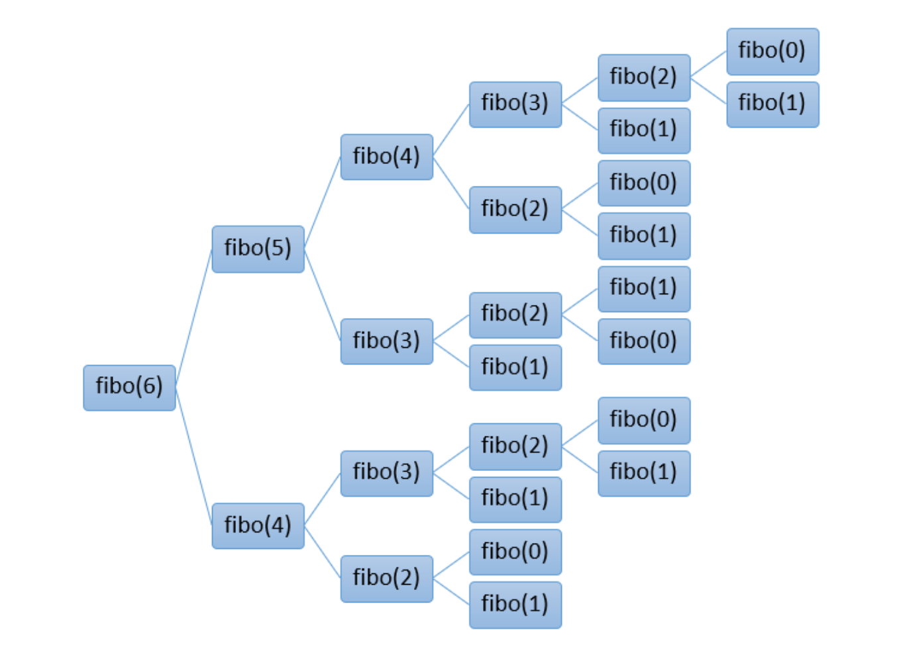
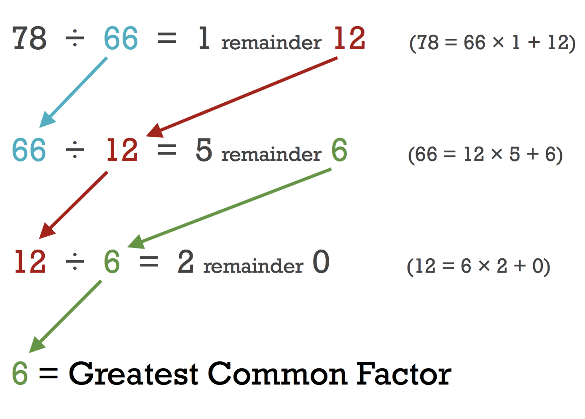

# 12회. 알고리즘

### 1. Bit Manipulation - set/get/update/clear bits, 2의 곱 / 나누기, 음수로 만들기 etc.

### 2. 팩토리얼

```js
function factorial(n) {
  if (n < 2) return 1;

  return n * factorial(n - 1);
}

console.log(factorial(0)); // 1
console.log(factorial(1)); // 1
console.log(factorial(2)); // 2
console.log(factorial(3)); // 6
console.log(factorial(4)); // 24
console.log(factorial(9)); // 362,880
```

### 3. 피보나치 수

```js
// 0, 1, 1, 2, 3, 5, 8, 13, 21, 34, 55, 89, 144, ...
function Fibonacci(n) {
  if (n <= 1) {
    return n;
  }

  return Fibonacci(n - 1) + Fibonacci(n - 2);
}

console.log(Fibonacci(1)); // 0 (0)
console.log(Fibonacci(2)); // 1 (0+1)
console.log(Fibonacci(3)); // 2 (1+1)
console.log(Fibonacci(4)); // 3 (1+2)
console.log(Fibonacci(5)); // 5 (2+3)
console.log(Fibonacci(6)); // 8 (3+5)
```



### 4. 소수 판별 (trial division 방식)

- 소수: 두 개의 고유한 약수(1과 자기 자신)만을 가지는 자연수 , 음수는 소수가 아니다.
- 접근 방법<br/>
  : 제곱근을 구해 약수가 있는지 판별하는 법<br/>
  : O(log N) : 모든 수를 다 순회하지 않아도 되서

내가 푼 코드

```js
function isPrime(n) {
  const sqrtNum = Math.sqrt(n);

  // 1. 제곱근이 있으면 f
  if (sqrtNum % 1 === 0) {
    return false;
  }

  let m = Math.floor(sqrtNum); // 3

  while (m > 0) {
    const divide = n / m; // 2.숫자를 제곱근(정수)로 나눠봄

    if (divide % 1 !== 0) {
      m -= 1;
      continue; // 3.나눈 결과가 정수가 아니면 m을 -1 해가면서 계속 나누기 진행
    }

    if (divide === n) {
      return true; // 4-1.나눈 결과가 정수이고, 자기자신이면 t
    } else {
      return false; // 4-1.나눈 결과가 정수이고, 자기자신이 아니면 f
    }
  }
}
```

모범 코드

```js
function isPrime3(num) {
  if (num === 1) return false;
  for (let i = 2; i <= parseInt(Math.sqrt(num)); i++) {
    if (num % i === 0) return false;
  }
  return true;
}

console.log(isPrime(1)); // false
console.log(isPrime(2)); // true
console.log(isPrime(3)); // true
console.log(isPrime(4)); // false
console.log(isPrime(5)); // true
console.log(isPrime(9)); // f
console.log(isPrime(10)); // f
console.log(isPrime(11)); // tru
console.log(isPrime(16)); // false
console.log(isPrime(17)); // true
console.log(isPrime(18)); // false
console.log(isPrime(19)); // true
console.log(isPrime(20)); // false
console.log(isPrime(23)); // true
```

### 5. 유클리드 호제법

<b>1) 최대공약수 (GCD)</b><br/>
최대공약수는 두 수 또는 그 이상의 여러 수에서 공통으로 나누어지는 가장 큰 수<br/>

ex) 12와 18의 최대공약수<br/>
12의 약수: 1, 2, 3, 4, 6, 12 / 18의 약수: 1, 2, 3, 6, 9, 18<br/>
공통 약수는 1, 2, 3, 6이며, 이 중에서 가장 큰 수는 6 <- 12와 18의 최대공약수임.

- 유클리드 호제법 활용
  - b가 0일 때, a가 최대공약수임

```js
function gcd(a, b) {
  if (b === 0) {
    return a;
  }
  return gcd(b, a % b);
}
```



<Br/>
<b>2) 최대공배수 (LCD)</b><br/>
최소공배수는 두 수 에서 공통으로 나타나는 가장 작은 배수입니다. <br/>

ex) 4와 5의 최소공배수<br/>
4의 배수: 4, 8, 12, 16, 20, 24, 28, 32, ... <br/>
5의 배수: 5, 10, 15, 20, 25, 30, 35, ...<br/>
공통 배수는 20, 40, 60 등이며, 이 중에서 가장 작은 수는 20 <- 4와5의 최소공배수임

```js
function lcm(a, b) {
  return (a * b) / gcd(a, b);
}
```
