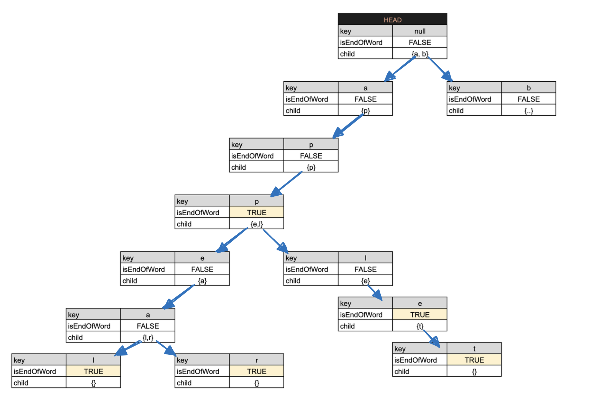

# 13회-1. 자료구조 - 트라이

## 📌 트라이

- 문자열이나 단어를 효율적으로 저장하고 검색을 위한 트리 기반 자료 구조
- 활용 : 접두사 기반 검색 , 텍스트 자동 완성 기능, 사전 검색 등<br/>

<b> <특징> </b>

- 검색 시간 복잡도 : O(m) (m은 문자열의 길이) , 문자열 길이만큼의 시간이 소요됨.

- 장점 : 문자열의 접두사로 시작하는 모든 단어를 효율적으로 찾을 수 있어 자동 완성 기능에 적합함<br/>
- 단점 : 각 노드가 문자 하나를 저장하므로 많은 메모리를 사용할 수 있음

<b> <구현> </b>

  

[사진 출처](https://velog.io/@kimdukbae/%EC%9E%90%EB%A3%8C%EA%B5%AC%EC%A1%B0-%ED%8A%B8%EB%9D%BC%EC%9D%B4-Trie)

- 루트 노드는 빈 문자와 연관 있다.(문자가 할당되어있지 않다)
- to,te는 t라는 공통 접두어를 갖게됨

<b> <코드> </b>

```js
class Node {
  constructor(key) {
    this.key = key;
    this.children = {};
    this.isEndOfWord = false;
  }
}

class Trie {
  constructor() {
    this.head = new Node(null);
  }

  // [문자열 삽입]
  insert(word) {
    let currNode = this.head;

    for (let char of word) {
      if (!currNode.children[char]) {
        currNode.children[char] = new Node(char);
      }
      currNode = currNode.children[char];
    }
    currNode.isEndOfWord = true;
  }

  // [문자열 검색] -  주어진 접두사로 시작하는 모든 단어를 검색
  findWordsWithPrefix(prefix) {
    let currNode = this.head;

    for (let char of prefix) {
      if (!currNode.children[char]) {
        return [];
      }
      currNode = currNode.children[char];
    }

    return this._findAllWords(currNode, prefix);
  }

  // [문자열 검색] 주어진 노드에서 시작하는 모든 단어 찾기
  _findAllWords(node, prefix) {
    let words = [];

    if (node.isEndOfWord) {
      words.push(prefix);
    }

    for (let child in node.children) {
      words.push(...this._findAllWords(node.children[child], prefix + child));
    }

    return words;
  }

  // [문자열 존재 여부] - 주어진 문자열이 Trie에 존재하는지 확인
  containsWord(word) {
    let currNode = this.head;

    for (let char of word) {
      if (!currNode.children[char]) {
        return false;
      }
      currNode = currNode.children[char];
    }

    return currNode.isEndOfWord;
  }

  // [접두사 존재 여부] - 주어진 접두사로 시작하는 문자열이 Trie에 존재하는지 확인
  hasPrefix(prefix) {
    let currNode = this.head;

    for (let char of prefix) {
      if (!currNode.children[char]) {
        return false;
      }
      currNode = currNode.children[char];
    }

    return true;
  }
}

// 사용 예제
const trie = new Trie();

// <생성>
trie.insert("app");
trie.insert("appeal");
trie.insert("appear");
trie.insert("appendix");
trie.insert("apple");
trie.insert("applet");

trie.insert("banana");
trie.insert("band");
trie.insert("bandage");
trie.insert("bandit");
trie.insert("base");
trie.insert("basket");

trie.insert("cat");
trie.insert("cater");
trie.insert("category");
trie.insert("cattle");

// <자동완성 단어 찾기>
console.log(trie.findWordsWithPrefix("app")); // ["app", "appeal", "appear", "appendix", "apple", "applet"]
console.log(trie.findWordsWithPrefix("ban")); // ["banana", "band", "bandage", "bandit"]
console.log(trie.findWordsWithPrefix("ba")); //  ["banana", "band", "bandage", "bandit", "base", "basket"]
console.log(trie.findWordsWithPrefix("apr")); // []
console.log(trie.findWordsWithPrefix("cat")); // ["cat", "cater", "category", "cattle"]

// <존재여부 판별>
console.log(trie.containsWord("app")); // true
console.log(trie.containsWord("appeal")); // true
console.log(trie.containsWord("applet")); // true
console.log(trie.containsWord("ap")); // false
console.log(trie.containsWord("applettt")); // false
console.log(trie.hasPrefix("ap")); // true

console.log(trie.containsWord("cat")); // true
console.log(trie.containsWord("cater")); // true
console.log(trie.containsWord("cattle")); // true
console.log(trie.containsWord("cattleee")); // false
console.log(trie.hasPrefix("cat")); // true
```

<b><"app, appeal, appear, apple, applet" 삽입 상태>
</b>

---

## 📌 트라이 활용 알고리즘 문제

[프로그래머스 - 자동완성 Lv. 4](https://school.programmers.co.kr/learn/courses/30/lessons/17685)

```js
class Node {
  constructor(value = "", end = false) {
    this.value = value;
    this.end = end;
    this.child = new Map();
    this.includesWords = [];
  }
}

class Trie {
  constructor() {
    this.root = new Node();
  }
  insert(string) {
    let cur_node = this.root;

    for (const char of string) {
      if (!cur_node.child.has(char)) {
        cur_node.child.set(char, new Node(cur_node.value + char));
      }
      cur_node = cur_node.child.get(char);
      cur_node.includesWords.push(string);
    }
    cur_node.end = true;
  }
  min_len(string) {
    let cur_node = this.root;
    let len = 0;
    for (const char of string) {
      cur_node = cur_node.child.get(char);
      len++;
      if (cur_node.includesWords.length === 1) return len;
    }
    return len;
  }
}

function solution(words) {
  const trie = new Trie();
  words.forEach((item) => trie.insert(item));
  return words.map((item) => trie.min_len(item)).reduce((a, b) => a + b);
}
```
